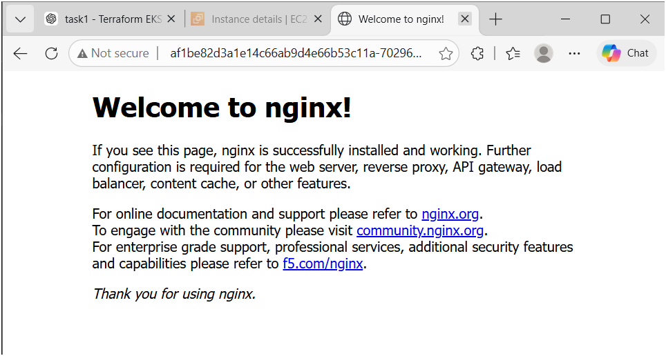

# 🚀 Terraform EKS Static App Deployment

A complete Infrastructure as Code (IaC) project that provisions an AWS environment using Terraform and deploys a static web application on Amazon EKS.

This project automatically creates:

* Custom VPC
* Public Subnets
* Internet Gateway
* Route Tables
* Amazon EKS Cluster
* Managed Node Group
* EC2 Bastion / Cluster Access Machine
* Kubernetes Deployment and Service
* AWS Load Balancer exposing the application publicly

---

# 📌 Project Architecture

```text
Terraform
   │
   ├── VPC + Subnets + Internet Gateway
   ├── EKS Cluster + Worker Nodes
   ├── EC2 Bastion Host
   │
SSH into EC2
   │
Install AWS CLI + kubectl
   │
Connect to EKS Cluster
   │
Deploy nginx application using Kubernetes YAML files
   │
Expose application using Service type LoadBalancer
```

---

# 🛠️ Technologies Used

* Terraform
* AWS VPC
* Amazon EKS
* EC2
* IAM
* Kubernetes
* kubectl
* AWS CLI
* YAML
* nginx

---

# 📂 Project Structure

```text
terraform-eks-static-app/
│
├── provider.tf
├── variables.tf
├── vpc.tf
├── eks.tf
├── ec2.tf
├── outputs.tf
├── .gitignore
├── .terraform.lock.hcl
│
└── app/
    ├── deployment.yaml
    └── service.yaml
```

---

# 📄 File Explanation

## provider.tf

Configures the AWS provider and region.

```hcl
provider "aws" {
  region = var.region
}
```

---

## variables.tf

Contains reusable variables.

```hcl
variable "region" {
  default = "ap-south-1"
}

variable "cluster_name" {
  default = "my-eks-cluster"
}
```

---

## vpc.tf

Creates:

* VPC
* Internet Gateway
* Two Public Subnets
* Route Table
* Route Table Associations

Purpose:
To provide networking for the EKS cluster and EC2 instance.

---

## eks.tf

Creates:

* IAM Role for EKS
* IAM Role for Worker Nodes
* EKS Cluster
* Managed Node Group

Purpose:
To provision a fully managed Kubernetes cluster in AWS.

---

## ec2.tf

Creates:

* Security Group allowing SSH
* EC2 instance used as Bastion Host / Cluster Access Machine

Purpose:
To securely connect to the EKS cluster using kubectl.

---

## outputs.tf

Displays:

* EKS Cluster Name
* EC2 Public IP

Example:

```text
ec2_public_ip = "35.xx.xx.xx"
eks_cluster_name = "my-eks-cluster"
```

---

# ⚙️ Terraform Commands Used

```bash
terraform init
terraform plan
terraform apply
```

### terraform init

Downloads the AWS provider and initializes the Terraform project.

### terraform plan

Shows what resources Terraform will create.

### terraform apply

Creates the AWS resources.

---

# 🔐 Configure AWS CLI

```bash
aws configure
```

Provide:

```text
AWS Access Key ID
AWS Secret Access Key
Region: ap-south-1
Output format: json
```

---

# ☸️ Connect kubectl to EKS

```bash
aws eks update-kubeconfig --region ap-south-1 --name my-eks-cluster
kubectl get nodes
```

Expected output:

```text
NAME                                      STATUS
ip-10-0-1-89.ap-south-1.compute.internal  Ready
ip-10-0-2-66.ap-south-1.compute.internal  Ready
```

---

# 🚀 Deploy the Application

```bash
kubectl apply -f app/deployment.yaml
kubectl apply -f app/service.yaml
```

Check pods:

```bash
kubectl get pods
```

Check service:

```bash
kubectl get svc
```

---

# 📷 Application Output

After the LoadBalancer is created, open the external DNS in the browser.

> Save your screenshot inside the repository as:
>
> `images/output.png`

Then this image will appear in the README:

```md

```



---

# 📄 deployment.yaml

```yaml
apiVersion: apps/v1
kind: Deployment
metadata:
  name: static-web
spec:
  replicas: 2
  selector:
    matchLabels:
      app: static-web
  template:
    metadata:
      labels:
        app: static-web
    spec:
      containers:
      - name: static-web
        image: nginx
        ports:
        - containerPort: 80
```

### Explanation

* Creates a Kubernetes Deployment
* Runs 2 replicas of nginx
* Ensures high availability
* If one pod fails, another pod continues serving the application

---

# 📄 service.yaml

```yaml
apiVersion: v1
kind: Service
metadata:
  name: static-web-service
spec:
  type: LoadBalancer
  selector:
    app: static-web
  ports:
    - protocol: TCP
      port: 80
      targetPort: 80
```

### Explanation

* Exposes the nginx pods to the internet
* Creates an AWS Elastic Load Balancer automatically
* Routes external traffic to the pods

---

# 🔍 Interview Explanation

> I used Terraform to automate the complete AWS infrastructure setup. I created a custom VPC, two public subnets, an internet gateway, an EKS cluster, a managed node group, and an EC2 bastion host.
>
> Then I connected to the EC2 instance through SSH, configured AWS CLI, installed kubectl, and connected kubectl to the EKS cluster.
>
> After that, I deployed a Kubernetes Deployment running nginx and exposed it through a Service of type LoadBalancer.
>
> AWS automatically created a public load balancer, and I accessed the application in the browser.

---

# 📚 Key Concepts Used

* Infrastructure as Code (IaC)
* Terraform State File
* AWS IAM
* Amazon EKS
* Kubernetes Deployment
* Kubernetes Service
* LoadBalancer
* High Availability
* Bastion Host
* Worker Nodes

---

# 🧹 Cleanup

To delete all AWS resources:

```bash
terraform destroy
```

---

# 👩‍💻 Author

**Jayanthi Claret**

Third-Year Electronics and Communication Engineering Student
Passionate about Cloud Computing, DevOps, and AWS.
